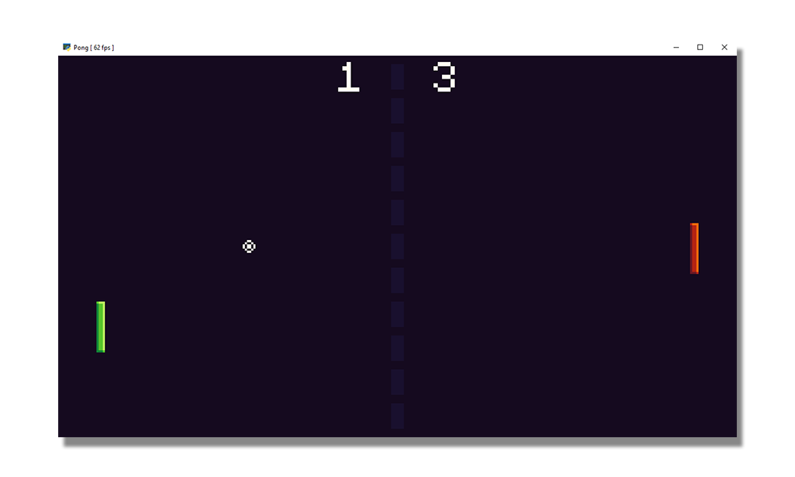

# pysdl2 pong demo

This is a little project I made to learn SDL.

Most notably, the things I was trying to learn were:
- Creating a window and rendering context
- Handling input
- Playing audio
- Managing a constant framerate
  - This isn't perfect, but I think I did an okay job. I still have more to learn about VSync.

There's nothing groundbreaking here, but I found a lot of useful examples while I was making this,
so hopefully this can help someone else who is learning their way around SDL.

## How to run

- Create a Python 3.10 virtual environment
- Pip install the requirements from `requirements.txt`
- Run the `main.py` file.

## SDL Libraries
If you are on Windows, the .dll files are provided.

If you are on another operating system, you'll have to provide your own library files for:
- SDL2
- SDL2_image
- SDL2_mixer
- SDL2_ttf

Place those in the `dll` folder.
You can get the library files from https://github.com/libsdl-org

## How to play

Use the up and down arrow keys to control your paddle.

The computer player isn't particularly well made, and there is no win condition.
